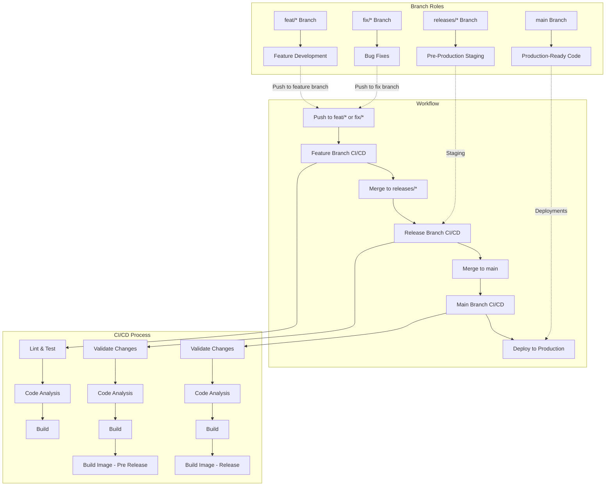

# Project CASPER

### Members:

- Cyril Cuvelier
- Paul Marliot
- Thibaut Tournemaine
- Rémi Van Boxem

### How to use it 

Please refer to this [file](https://github.com/CloudComputingCPRT/Casper/blob/main/HOWTO.md)

### Workflow
We used github reusable actions for more adaptability. It's overkill for the actual project but a good example of how it should work for a bigger project. 

- For the working branches we added a linter (flake8), used the provided tests, a code analysis and a build check.  
- For the releases and main branches, we first validate the changes comming from the pullrequest and then use the same workflow without the lient & test, and adding a build docker image action to create our packages.

