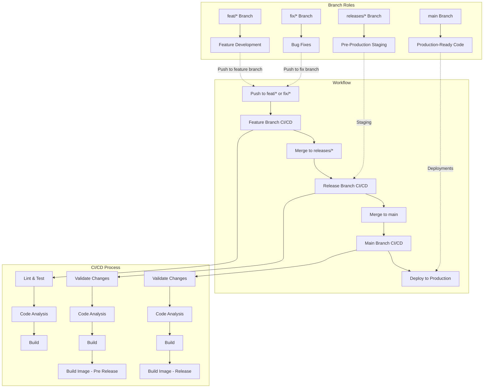

# Project CASPER

## Members:

- Cyril Cuvelier
- Paul Marliot
- Thibaut Tournemaine
- Rémi Van Boxem

## How to Use

### Local Setup

Follow the instructions in the [HOWTO.md file](https://github.com/CloudComputingCPRT/Casper/blob/main/HOWTO.md) to set up the project locally.

### Configuration

Create a `terraform.tfvars` file in the `./infrastructure/` directory and populate it with the following variables:

```hcl
github_handle         = "<your GitHub account name>"
email_address         = "<your Azure email address>"
subscription_id       = "<your Azure subscription ID>"
database_name         = "<desired name for the database>"
database_username     = "<desired username for the database>"
new_relic_licence_key = "<your New Relic license key>"
```

---

## Workflow

Our CI/CD pipeline leverages reusable GitHub Actions for modularity and scalability, making the workflows adaptable to other teams or projects. While this approach is robust and reusable, it exceeds the complexity required for this project but serves as a demonstration of best practices for larger projects.

### Branch Management

- **Main Branch (`main`)**: Production-ready code.
- **Release Branches (`releases/*`)**: Pre-production staging.
- **Feature Branches (`feat/*`)**: Feature development.
- **Fix Branches (`fix/*`)**: Bug fixes.

### CI/CD Pipeline Overview

The pipeline ensures quality and reliability at every stage:

- **Feature Branches**: Linting, testing, code analysis, and build checks.
- **Release Branches**: Validation of pull requests, code analysis, and pre-release image builds.
- **Main Branch**: Validation of changes, code analysis, and production-ready image builds.

### Workflow Diagram



---

## Troubleshooting

During the project, several issues were encountered. Below are the key challenges and their resolutions:

### Deployment

- **Issue**: Students' accounts lacked permissions to create credentials for GitHub Actions.
- **Solution**: Deployment with commented-out credentials in `build_image.yml` was attempted, but additional manual setup was required.

### Database

- **Issue**: Two database users were created, and the app's user lacked read/write permissions.
- **Identification**: Populated the database using Azure CLI and identified a misconfiguration.
- **Solution**: Forced password login and deactivated Entra ID login.

### Virtual Network

- **Issue**: Late-stage implementation of the virtual network caused significant delays and broke existing Terraform modules.
- **Identification**: Increased time consumption without functional gains.
- **Solution**: No resolution during the project. For future projects, virtual network setup should be a priority.

---
